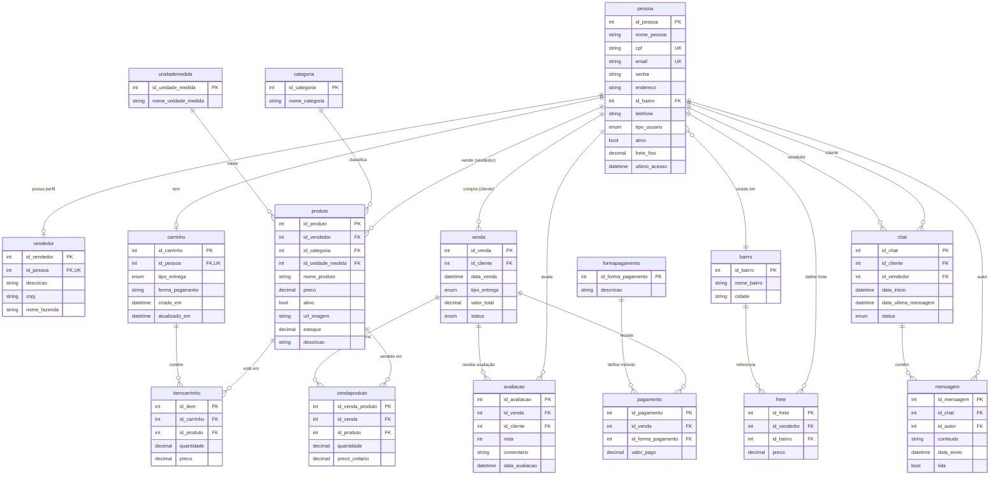

# DER — Verdear

Diagrama Entidade-Relacionamento gerado a partir de `prisma/schema.prisma`.

## Legenda

- `PK` chave primária
- `FK` chave estrangeira
- `UK` restrição UNIQUE
- Cardinalidade Mermaid: `||--o{` = um-para-muitos; `||--o|` = um-para-um opcional; `}o--||` = muitos-para-um.

## Enums

- `tipo_usuario_enum`: CLIENTE, VENDEDOR
- `tipo_entrega_enum`: ENTREGA, RETIRADA
- `status_venda_enum`: ABERTA, FINALIZADA, CANCELADA
- `status_chat_enum`: ATIVO, FINALIZADO
